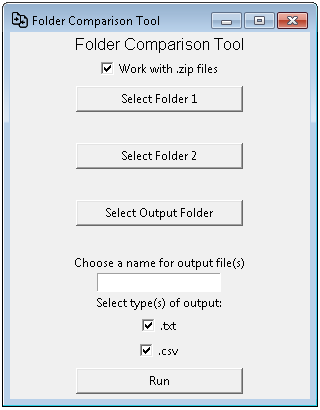

# foldercompare

This is a fork from [Andy Roche's foldercompare repository](https://github.com/rocheio/foldercompare) in which he created a  Windows application that compares the content of two folders from a graphic interface. Outputs a simple report to a `.txt` file, `.csv` file, or both. He posted a detail explanation of the application on his [blog post][blog]

If you're on a Mac or Unix machine, please just use the Bash [`diff`][bash-diff] command.

I added the feature to also compare `.zip` files, which uncompresses the files into folders and do the comparison of the two uncompressed folders. After comparison the **only** uncompressed folder will be deleted.

Another feature is that the comparison will also show the file size, which is useful for those files that are in both folders but it content might be different.


This is how it will do **normal folder** comparison:

<p align="center">
  
</p>

And this is how it will do the **`.zip` folders** comparison:

<p align="center">
  
</p>

**NOTE:**
Please notice the checkbox being marked to work with `.zip` files, if checkbox is not marked then you'll be able to work with regular folders.

And this is how the `.txt` file will look for another comparison:
```
COMPARISON OF FILES BETWEEN FOLDERS:
	FOLDER 1: D:\Files\Python\folder1		
	FOLDER 2: D:\Files\Python\folder2		


FILES ONLY IN: D:\Files\Python\folder1
	D:\Files\Python\folder1\Data Folder\test_text.txt                 |          0.00 bytes
	D:\Files\Python\folder1\Data Folder\test_word.docx                |             5.03 KB
	D:\Files\Python\folder1\Data Folder\test_folder\test_image.bmp    |          0.00 bytes


FILES ONLY IN: D:\Files\Python\folder2
	None


FILES IN BOTH FOLDERS:
	D:\Files\Python\folder1\Data Folder\test_excel.xlsx               |             6.35 KB
	D:\Files\Python\folder2\Data Folder\test_excel.xlsx               |             6.35 KB
	D:\Files\Python\folder1\Data Folder\test_powerpoint.pptx          |            32.27 KB
	D:\Files\Python\folder2\Data Folder\test_powerpoint.pptx          |            32.27 KB
	D:\Files\Python\folder1\Data Folder\test_zip.zip                  |             9.29 KB
	D:\Files\Python\folder2\Data Folder\test_zip.zip                  |             9.41 KB
	D:\Files\Python\folder1\Data Folder\test_folder\test_folder_text.txt|          0.00 bytes
	D:\Files\Python\folder2\Data Folder\test_folder\test_folder_text.txt|          0.00 bytes
```

[Download the program here][exe-download]


## About

[Andy's foldercompare project](https://github.com/rocheio/) was using the Python standard library package [`filecmp`][filecmp] to do the comparison and [`tkinter`][tkinter] to build the GUI. I have added the [`zipfile`][zipfile] package which is also included on the Python standard library package to work with `.zip` files.

To build the `.exe` file, [PyInstaller][pyinstaller] is used to package the script into an executable file.

## Building the `.exe` file:

1. Install [Python 3.5][python]
2. Clone this [repo](https://github.com/yeyeto2788/foldercompare)
3. Install requirements using `pip install -r requirements.txt`
4. Run tests using `python -m unittest tests/test_foldercompare.py`
5. Build the program using the script `./build_exe.sh` or the `./build_exe.bat`
6. The standalone program is now located in the top-level folder


## TODO list:

- [ ] Fix tests for new implementations.
- [ ] An `.html` version of the comparison.
- [ ] Port code to Linux based desktop.
- [ ] Wiki page for using the `foldercompare.py` as a module.
- [X] ~~Add icon to application.~~

[bash-diff]: http://ss64.com/bash/diff.html
[blog]: https://roche.io/2016/06/01/comparing-folders-python
[exe-download]: https://raw.githubusercontent.com/yeyeto2788/foldercompare/master/foldercompare.exe
[filecmp]: https://docs.python.org/3.5/library/filecmp.html
[pyinstaller]: http://www.pyinstaller.org/
[python]: https://www.python.org/downloads/
[tkinter]: https://docs.python.org/3.5/library/tkinter.html
[zipfile]: https://docs.python.org/3.4/library/zipfile.html
